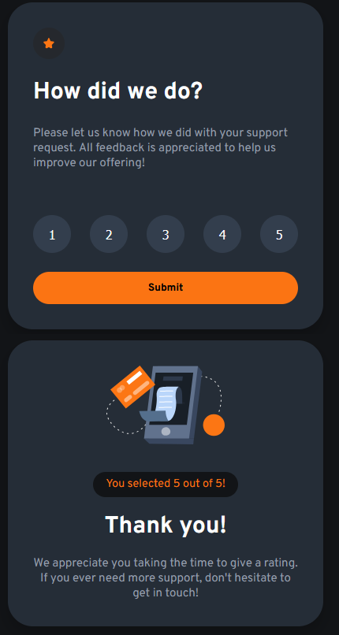

# Frontend Mentor - Interactive rating component solution

This is my solution to the [Interactive rating component challenge on Frontend Mentor](https://www.frontendmentor.io/challenges/interactive-rating-component-koxpeBUmI). Frontend Mentor challenges help you improve your coding skills by building realistic projects. 

## Table of contents

- [Overview](#overview)
  - [The challenge](#the-challenge)
  - [Screenshot](#screenshot)
  - [Links](#links)
- [My process](#my-process)
  - [Built with](#built-with)
  - [What I learned](#what-i-learned)
  - [Useful resources](#useful-resources)
- [Author](#author)

**Note: Delete this note and update the table of contents based on what sections you keep.**

## Overview

### The challenge

Users should be able to:

- View the optimal layout for the app depending on their device's screen size
- See hover states for all interactive elements on the page
- Select and submit a number rating
- See the "Thank you" card state after submitting a rating

### Screenshot

### Links

- Solution URL: [Link to GitHub repository](https://github.com/KaerailearS/FrontEndMentor-RatingComponent)

## My process

### Built with

- Semantic HTML5 markup
- CSS custom properties
- Flexbox
- CSS Grid

### What I learned

Initially built the app with two different pages, startup page and a thank-you page.
Learned more about DOM manipulation using JavaScript while building the app, ended up restarting the entire project and instead built one page where I simply altered the existing elements and their contents.

### Useful resources

- [Google](https://www.google.com/) - Googling anything I had issues with, didn't understand or dealt with for the first time helped immensely.
- [ChatGPT](https://chatgpt.com/) - Asking ChatGPT for code optimizations, or having it explain some systems, methods or other JavaScript related stuff.
- [MDN Web Docs](https://developer.mozilla.org/en-US/) - MDN Web Docs popped up alot from Google searches, and has an immense amount of information for web development.
- [W3Schools](https://www.w3schools.com/) - Similar to MDN Web Docs, very common result from Google searches, and also hosts alot of relevant information.

## Author

- GitHub - [KaerailearS](https://github.com/KaerailearS)